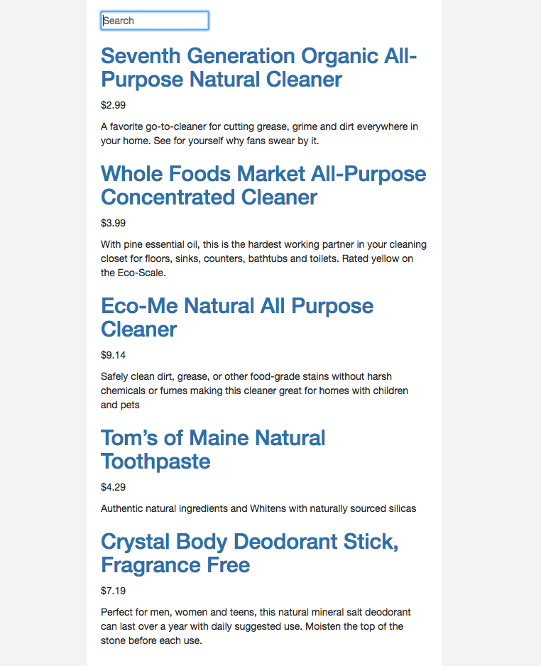
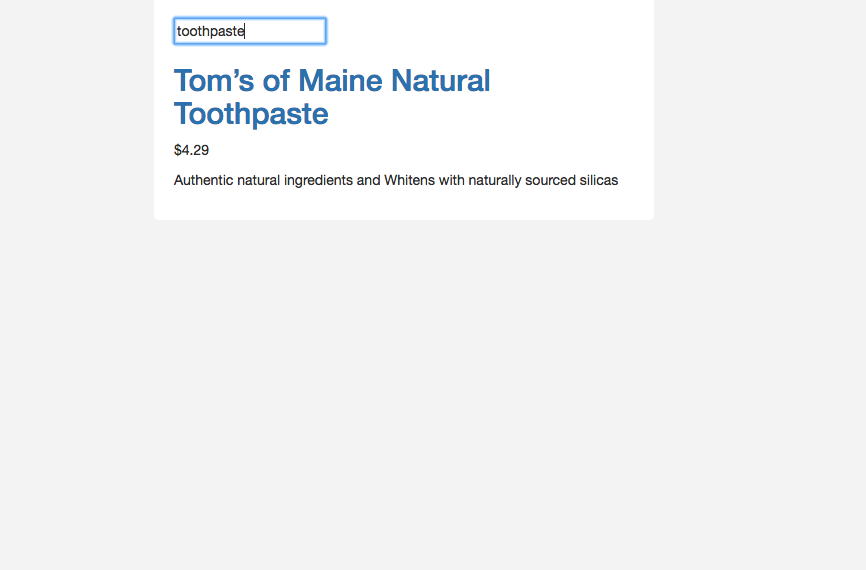

### Easy Search

### Geting started 

```
> git clone 
> cd into directory 
> npm install 
> npm run server
> go to: localhost:8080, in your browser

```

* I build this basic app using ReactJS
* The ideea is to search your favourite product from a big list of products 
* The products are kept in a separate file called 'products.js'
* If the user is adding extra spaces in the input those are removed automatically 
* Project is structured in several components and the code is nice and clean 

* All products are displayed on the UI when starting the app 



* You can choose you favourite product from a wide range of products

